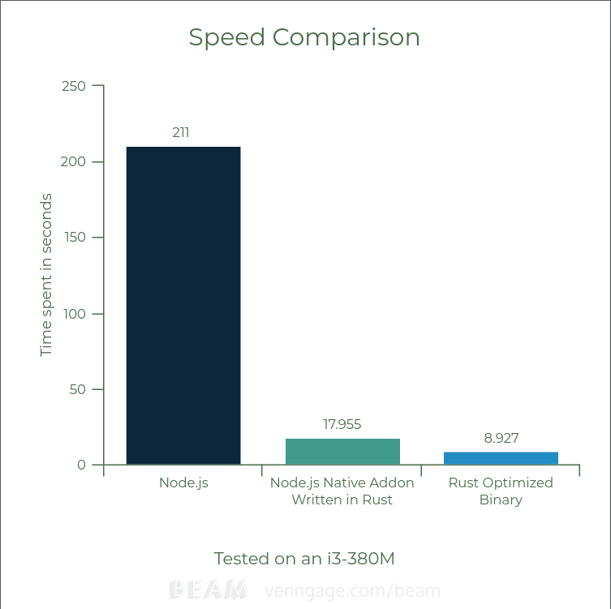

# neon-test

This was done with the intention of serving as a simple test to learn a little about the difference in performance between:

A code written in Rust compiled and optimized with the rustc compiler;

A native Node.js addon written in Rust with the help of this very useful tool called [Neon](https://github.com/neon-bindings/neon);

Pure JavaScript code running on Node.js;

The algorithm must find the element of the number 10000000000 of the [Fibonacci Sequence](https://en.wikipedia.org/wiki/Fibonacci_number), for that purpose it will do it with brute force and not with the binet's formula.



To test on your machine:

```
$ git clone https://github.com/Kenedy-Henrique/neon-test_addon
$ cd neon-test/
```

Testing the pure JavaScript code:
```
$ node ./test_node.js
```

Testing the Node.js addon:
```
$ node ./test_addon.js
```

Testing the Rust binary:
```
$ ./rust_binary/target/release/rust_binary
```